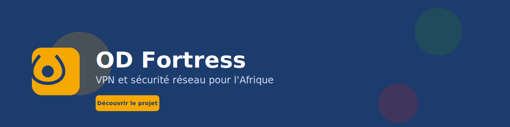
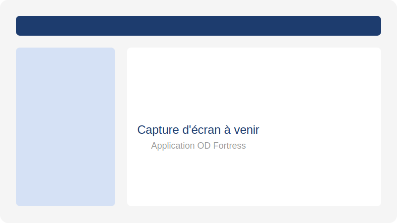

  

# OD Fortress

### VPN et sécurité réseau pour l'Afrique francophone

 

## Table des matières

 

## Présentation

**OD Fortress** est une solution de VPN et de sécurité réseau conçue pour le marché africain francophone. Elle permet aux utilisateurs de naviguer de manière sécurisée, de contourner les restrictions géographiques et de protéger leur vie privée sur les réseaux Wi-Fi publics et en mobile data.

OD Fortress vise à offrir une alternative abordable, accessible en Mobile Money et adaptée aux infrastructures locales.

 

## Le problème

<table>
<tr>
<td width="50%" valign="top">

### Accès et coût

Les VPN internationaux restent coûteux et leur paiement par carte bancaire est souvent inaccessible localement. Les utilisateurs font également face à des restrictions d'accès à certains contenus et services en ligne.

</td>
<td width="50%" valign="top">

### Sécurité et liberté

Les risques sur les réseaux Wi-Fi publics, vol de données et espionnage, restent élevés, tandis que le manque de solutions VPN locales avec support et paiement adaptés limite la liberté d'accès à l'information.

</td>
</tr>
</table>

 

## La solution

OD Fortress propose une application VPN sécurisée pensée pour le contexte local.

Une application Android permet une connexion VPN en un clic avec des serveurs optimisés, appuyée sur une infrastructure dédiée au chiffrement moderne. Les protocoles sécurisés WireGuard, OpenVPN et IKEv2 garantissent la robustesse des connexions, sous une politique stricte de no-logs qui ne conserve aucune trace de navigation. Un kill switch coupe automatiquement internet si le VPN tombe, et le paiement se fait en Mobile Money, en FCFA, via MTN, Moov ou Wave. Un support local en français et dans les langues locales complète l'ensemble.

 

## Fonctionnalités principales

<table>
<tr>
<td width="50%" valign="top">

### 🔐 Sécurité et confidentialité

Connexion VPN rapide en un clic avec serveurs proches, chiffrement fort sur tous les réseaux et politique no-logs garantissant l'absence de collecte des données de navigation. Le kill switch protège contre les fuites de connexion, et un DNS sécurisé bloque le phishing et les malwares, complété par un anti-tracking contre les traqueurs et publicités.

</td>
<td width="50%" valign="top">

### ⚙️ Flexibilité et contrôle

Split tunneling pour choisir précisément quelles applications passent par le VPN, accès multi-serveurs à plusieurs pays et régions, et abonnements flexibles en plans journalier, hebdomadaire ou mensuel. Le paiement Mobile Money rend l'abonnement accessible sans carte bancaire, avec un tableau de bord pour suivre consommation, abonnement et appareils connectés.

</td>
</tr>
</table>

Pour plus de détails, consulter la documentation complète :

 

## Architecture générale

OD Fortress repose sur une architecture VPN client-serveur sécurisée, pensée pour la fiabilité et la simplicité d'usage.

L'application Android est développée en Kotlin avec un service VPN natif et une interface moderne. Les serveurs VPN tournent sur une infrastructure Linux avec WireGuard, OpenVPN et IKEv2. Le backend API en Node.js gère les utilisateurs, les abonnements et les serveurs, tandis que le paiement intègre à la fois le Mobile Money et les cartes bancaires. Un panel admin supervise serveurs, utilisateurs et abonnements, complété par un monitoring continu des serveurs et de la bande passante.

 

## Technologies utilisées

**Mobile**

**Serveurs VPN**

**Backend**

**Outils**

 

## Feuille de route

<table>
<tr>
<td width="15%"><strong>Phase 1</strong></td>
<td width="65%">Application Android VPN de base avec WireGuard</td>
<td width="20%"></td>
</tr>
<tr>
<td><strong>Phase 2</strong></td>
<td>Backend API, authentification et abonnements</td>
<td></td>
</tr>
<tr>
<td><strong>Phase 3</strong></td>
<td>Paiement Mobile Money et gestion des plans</td>
<td></td>
</tr>
<tr>
<td><strong>Phase 4</strong></td>
<td>Kill switch, split tunneling, DNS sécurisé</td>
<td></td>
</tr>
<tr>
<td><strong>Phase 5</strong></td>
<td>Panel admin, monitoring et support client</td>
<td></td>
</tr>
<tr>
<td><strong>Phase 6</strong></td>
<td>Expansion régionale et partenariats opérateurs</td>
<td></td>
</tr>
</table>

 

## Captures d'écran

Les captures d'écran sont ajoutées progressivement dans le dossier <code>assets/screenshots/</code>.

  

<em>Application OD Fortress</em>

 

## Démo

Une démo publique sera disponible prochainement dans le dossier `demo/`.

 

## Liens officiels

 

## Contact

Pour toute question, partenariat ou opportunité d'investissement.

 

  

OD Fortress · Votre accès internet, sécurisé et libre

